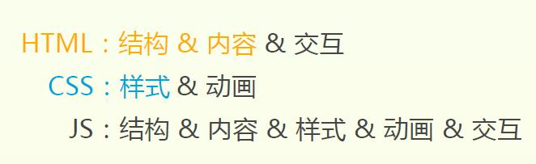

前端笔试题一份
==========================

废话在前
-----------------------------
学校招聘会一堆公司乱投的,杭州的一家小公司,应该也没听过.不过呢笔试面试还是差不多,要认真对待.笔试已经是周一的事情了,到现在才来整理.也算拖拉了.公司虽不大,题目还是挺全的,认真整理一遍还是有收获的.

正题
-----------------

1. 异步加载JS的方法,写出两个以上

> 

2. jquery绑定事件,写出两个以上

> 

3. 写一个正则表达式,验证是否为身份证号码

> 
    //身份证正则表达式(15位)    
    isIDCard1=/^[1-9]\d{7}((0\d)|(1[0-2]))(([0|1|2]\d)|3[0-1])\d{3}$/;    
    //身份证正则表达式(18位)       
    isIDCard2=/^[1-9]\d{5}[1-9]\d{3}((0\d)|(1[0-2]))(([0|1|2]\d)|3[0-1])\d{4}$/;

4. 为String对象扩展一个方法,删除前后空格

> 

5. 前端页面由哪三层构成,分别是什么?作用捏?

> 结构层(html)、表示层(css)、行为层(javascript&DOM).

6. 用过哪些浏览器?内核分别是什么?遇到哪些兼容性问题?为什么会出现这些问题?怎么解决?

> 

7. url = http://www.baidu.com/index.jsp?key0=0&key1=1&key2=2

> 

8. 简述ajax交互模型,如何解决跨域问题

> 

9. IE和非IE在实现JS存在哪些兼容性问题?

> 

10. 写一个生成页码函数,要求当前页码用粗体显示,当前页码的前后各显示n个页码(n可设置),总显示页码数是2n+1

> 

11. 判断一个字符串是否这样组成:第一个必须是字母,后面可以使字母,数字,下划线,总长度为5-20

> 

12. 截取字符串abcdefg 的efg

> 		str.substring(str.indexOf('efg'),str.indexOf('efg')+3);

13. 判断一个字符串中出现的次数最多的字符,统计这个次数(将字符串的字符保存在一个hash table 中,key是字符,value是次数)

> 

14. 求字符串的字节长度,假设英文字符占1个字节,中文字符占用2个字节.

> 	

15. 去掉一个数组的重复元素,例var arr = [1,1,2,3,3,2,1]

> 		
		

> 思路就是,两个指针i为标准,j后移,如果碰到相等的,则将数组最后一个数赋值给j.时间复杂度应该是o(n^2);这里将最后一个数覆盖到j位置上时,continue重复判断一下,如果相等就再将最后一个数赋值.这里避免了再一次重复循环吧.自己写的,木有参考代码.

16. this的典型应用

> this是执行上下文的属性.

> 应用:

> 1. 自定义原型对象是创建公有属性.如

>       function Person () {
		this.name = "coffee";
		this.age = "22";
    }
    
> 2. 函数代码中运行this.不举例了

> 3. 全局代码中使用this

> this需要注意的.参考资料:

> [深入理解JavaScript系列（13）：This? Yes,this!](http://www.cnblogs.com/TomXu/archive/2012/01/17/2310479.html)

> [JavaScript Function Invocation Patterns函数调用模式](https://github.com/CoffeeXu/Front-end/blob/master/JavaScript%20Function%20Invocation%20Patterns.md)鄙人上一篇翻译

17. 如何添加html元素的事件,有几种方法?

> 1. 直接和某个html空间绑定,如:

>       <a href="#" onclick = "text()">测试</a>

> 2. getElementById(id)获取控件后,再绑定.

> 3. 通过addEventListener或attachEvent()来绑定.

18. JS中如何检测一个变量的String类型?写出函数实现

> alert(typeof str);

19. document.write和innerHTML的区别

> document.write方法:向文档写 `HTML 表达式` 或 `JavaScript 代码`。

> innerHTML属性:设置或返回行的开始标签和结束标签之间的`HTML`.

> InnerText:设置或返回该HTML 元素的开始标签和结束标签之间的所有`文本`

20. 多浏览器检测通过什么?

> 我答IETester会不会太屌丝?还有几款[工具](http://www.cnblogs.com/lhb25/archive/2011/07/18/testing-cross-browser-compatability-tools.html)

> 难道这题问的是JS如何检测浏览器???使用user-agent字符串,具体方法如下:

> 	var sUserAgent = navigator.userAgent;//将user-agent字符串保存到本地
	var isOpera = sUserAgent.indexOf('Opera') > -1;
> 太复杂,略.

21. JS基础对象有哪些?window和document常用方法和属性列出来.

> 不懂何为基础对象?JS对象分为native object, build-in object,host object.本地对象包括常用的Object,Function,Array,Boolean,Date,Number,String,RegExp,Error,及带前缀的Error.内置对象只有Golbal和Math.宿主对象包括所有BOM和DOM对象.

> Window:

> 方法：setInterval,setTimeout,clearInterval,clearTimeout,alert,confirm,open

> 属性：name,parent,screenLeft,screenTop,self,top,status

> Document

> 方法：createElement,execCommand,getElementById,getElementsByName,getElementByTagName,write,writeln

> 属性：cookie,doctype,domain,documentElement,readyState,URL

废话在后
-----------------
未完等更新哈.
大量参考《JavaScript高级程序设计》第一版

